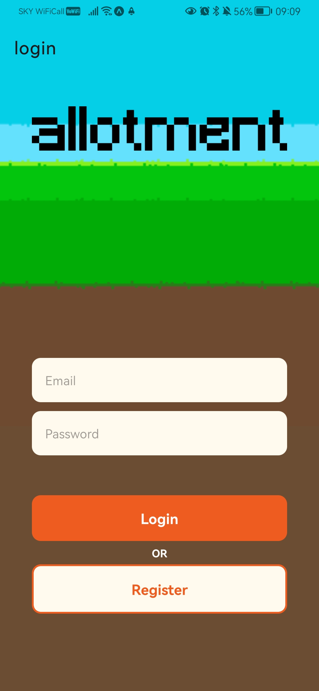

# Allotment

## About the this project:
This App was built in a team of 6 in the project phase of the software development bootcamp at Northcoders. It helps users organise and maintain a veg patch. 8-bit vegetables can be added to the user's in-app allotment, giving a harvesting window and task notifications.

The link below takes you to a video which demonstrates the app in action including navigation abd functionality.

    https://www.youtube.com/watch?v=GCAQsVTMuVE

## How to clone this project
In your terminal, use the command:

    git clone 

## How to Install dependencies
Navigate to the root directory of the repository and run this command:

    npm install

## Firebase Explanation???

## Minimum version of Node.js needed:

    Node: v19.6.0
