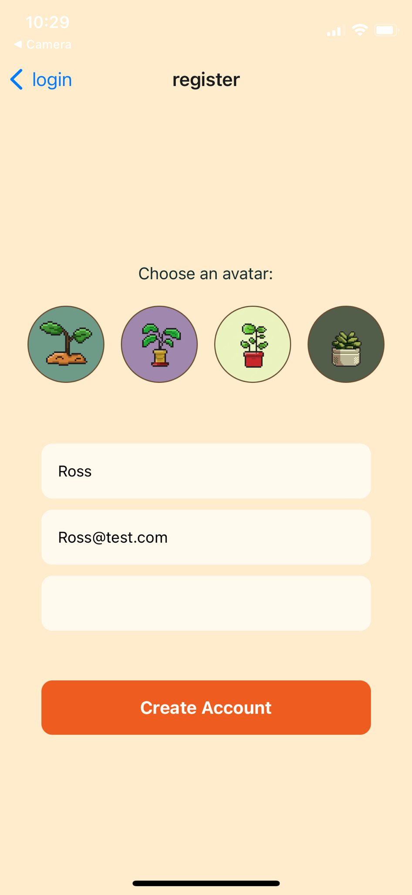
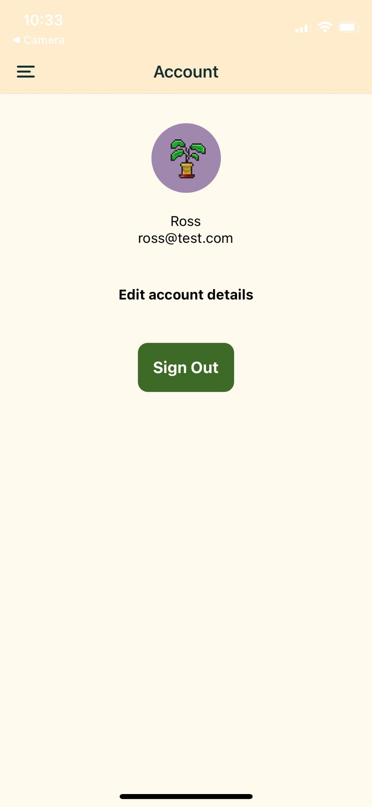
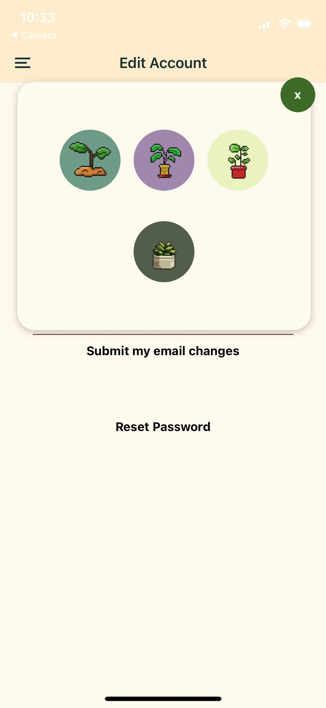
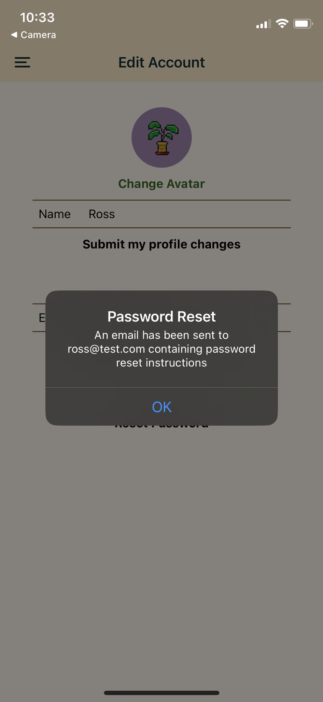
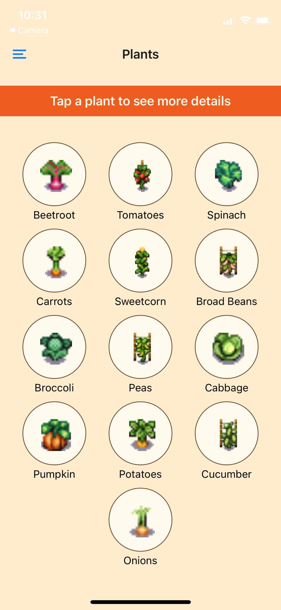
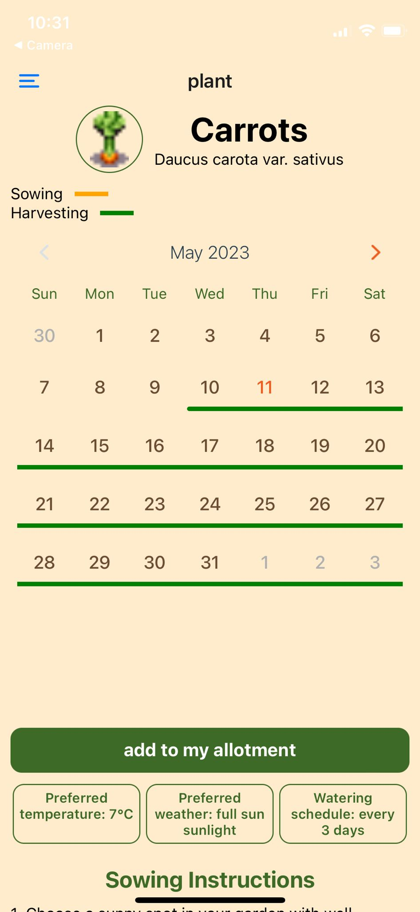
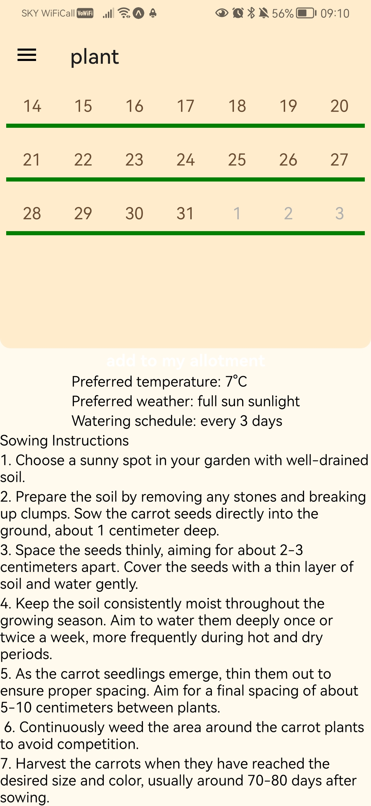
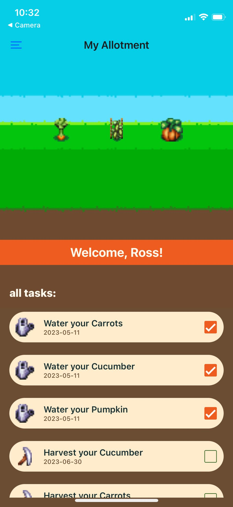
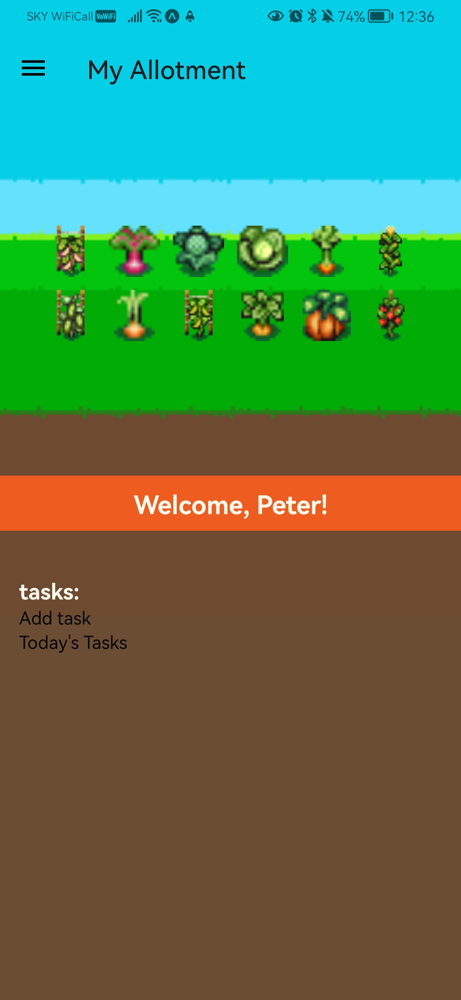

# Allotment

# For Users

## About the this project:
This App was built in a team of 6 in the project phase of the software development bootcamp at Northcoders. It helps users organise and maintain a veg patch. 8-bit vegetables can be added to the user's in-app allotment, giving a harvesting window and task notifications.

## The login or register page is the first screen a user will land on when they open the Allotment app:

## When the user selects register, they will be prompted to choose an avatar and fill out name, email and password fields:

## Once the user has logged in to the app, they have the option to edit their account details:

## The user can change their email, avatar, or password.

## When new users log in to the app for the first time, the allotment will be completely emtpy!

## The user can then use the Navbar on the left, click on 'plants' and got to the plants page:

## The user can click on a single plant to go to the information page for that plant. For example, the carrots page shows a sowing and harvesting calendar for carrots and a button for the user to add it to their allotment...

## ...and sowing instructions for carrots...

## When the user clicks on the add button they will be given a calendar to select a sowing date so that the harvesting window can be personalised for their allotment and put in their todo list:

## Once the user has added a plant, they will be given the option to view their updated allotment:

## Also, the add button will become a remove button for the plant which has just been added:

## Once the user has added their first plants, they will be able to view them in their allotment like so:

## Tasks relating to plants in the user's allotment will be listed below the allotment display on their allotment page. They will also come through as notifications on a user's device, daily, and at a set time. Users can check off tasks they have completed.

## The team wanted to use tamagotchi-style 8-bit vegetables to add a gamefied element to growing vegetables. Each plant has several images at different stages of growth to allow the user to see a visual progression in their allotment as time goes by, although this functionality has not been implemented yet. Here is an example of a full allotment.

## The link below takes you to a video which demonstrates the app in action including navigation abd functionality.

    https://www.youtube.com/watch?v=GCAQsVTMuVE

# For Developers

## How to clone this project
First, fork this repo, then copy the URL, and in your terminal, use the command:

    git clone <forked-repo-URL>

## Prerequisites

    node: v19.6.0
    npm: 9.4.0
    React Native CLI
    expo: 6.3.8

## How to Install dependencies
Navigate to the root directory of the repository and run this command:

    npm install

## Any further installations
If you wish to add any new packages, please use the following command so that it is compatible with the rest of the Expo ecosystem:

    expo install <package>

## Firebase 
Create a new firebase project and use Firebase's import/export feature to copy database schemas or rules as needed.
Firebase offers import/export operations for different types of data in different ways. 
Here are a few resources to help you:

### 1. Cloud Firestore: 
Firebase provides options to import and export Firestore data

    https://firebase.google.com/docs/firestore/manage-data/export-import

using the   
    
        gcloud 

command-line tool.

### 2. Firebase Realtime Database: 
Firebase allows you to import and export your data to/from your Realtime Database using the Firebase console or the 

        database:get 
    
and 
    
        database:set 

commands in the Firebase CLI.

### 3. Security Rules: 
Security rules for Firestore, Realtime Database, and Storage can be managed using the Firebase Console, CLI, or the REST API. Here's the documentation on how to Get Started with Firebase Security Rules.

    https://firebase.google.com/docs/rules/get-started#:~:text=To%20access%20your%20rules%20from,json%20file.

Remember to always keep a backup of your Firebase data and rules before performing any import/export operations, and to secure your data exports as they may contain sensitive information.

## How to run the app
Download the Expo Go app on your device, and in the command line run

    npx expo start

The terminal will show a QR code for you to scan using your phone's QR scanner. You can then click on the link it produces to load the app on your device.